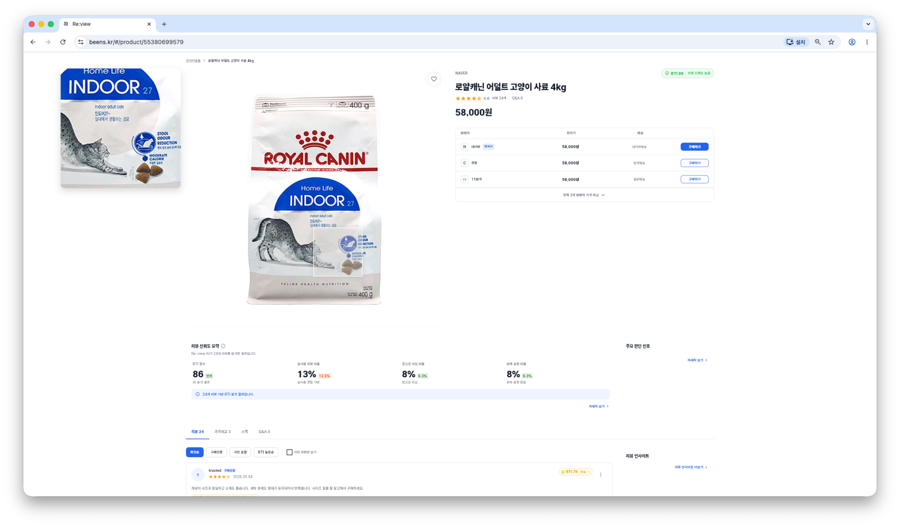

# Re:view

<p align="center">
  <b>실사용 리뷰 기반 쇼핑 신뢰도 분석 서비스</b><br/>
  상품 검색부터 리뷰 신뢰도 확인, 가격 비교, 관심 상품 관리까지 하나의 흐름으로 설계한 Flutter 애플리케이션
</p>

<p align="center">
  
  
  
  
  
  
</p>

<br/>

<table>
  <tr>
    <td colspan="2" align="center">
      <br/>
      <b>Home</b><br/>
      리뷰 기반 추천 상품과 카테고리 탐색
    </td>
  </tr>
  <tr>
    <td align="center" width="50%">
      <br/>
      <b>Search Results</b><br/>
      RTI, 가격, 리뷰 조건 기반 상품 비교
    </td>
    <td align="center" width="50%">
      <br/>
      <b>Product Detail</b><br/>
      리뷰 신뢰도 요약과 판매처별 가격 정보 제공
    </td>
  </tr>
</table>

## 📢 Demo & Materials

프로젝트의 실제 구동 화면과 상세한 기술 설계 내용이 담긴 발표 자료를 확인하실 수 있습니다.

* **🎬 [Re:view 서비스 시연 영상 보러가기](https://youtu.be/rIGmGRdqm48)**
* **📄 [FireView 프로젝트 1학기 발표 자료 (PPTX) 다운로드](./FireView%20프로젝트%201학기%20발표.pptx)**

---

## 🎯 Overview

Re:view는 사용자가 온라인 쇼핑 과정에서 광고성 리뷰와 실제 구매 후기를 구분하고, 더 신뢰도 높은 상품을 선택할 수 있도록 돕는 **리뷰 신뢰도 분석(RTI) 서비스**입니다.<br/>
단순 상품 목록 나열에 그치지 않고 `검색 → 필터링 → 상품 비교 → 상세 분석 → 찜/장바구니 관리`로 이어지는 실제 유저의 구매 의사결정 흐름을 상용 제품 수준으로 구현하는 데 집중했습니다.

Flutter 기반으로 구현해 **Web, Android, iOS** 크로스 플랫폼 환경에서 동일하고 매끄러운 핵심 경험을 제공합니다.

## 🚨 Problem

기존 이커머스 쇼핑 경험은 다음과 같은 명확한 한계를 지니고 있습니다.

- **정보의 비대칭성:** 리뷰 수와 단순 별점만으로는 실제 구매자의 '진짜 후기'를 판단하기 어려움
- **탐색 피로도:** 여러 판매처의 가격, 배송, 리뷰 정보를 한 번에 묶어서 비교하기 번거로움
- **검증의 외주화:** 교묘한 광고성 리뷰나 반복 표현이 많은 허위 리뷰를 사용자가 직접 읽고 걸러내야 함
- **추적의 어려움:** 관심 상품의 리뷰 신뢰도 변화와 가격 변동 흐름을 지속적으로 트래킹하기 어려움

## 💡 Solution

이 문제를 근본적으로 해결하기 위해 Re:view는 아래의 파이프라인과 UI 흐름을 설계했습니다.

- **RTI (Re:view Trust Index) 지표 도입:** AI가 실제 구매자 리뷰의 신뢰도를 종합해 산출한 직관적 지표를 상품 목록과 상세 화면 전반에 노출
- **원스톱 비교 탐색:** RTI, 가격대, 배송, 리뷰 조건 필터를 실시간으로 적용해 맞춤형 상품 비교
- **리뷰 인사이트 요약:** 광고성 및 위험 신호가 포함된 리뷰를 필터링하고, 신뢰도 높은 평가만 요약하여 제공
- **개인화 관리:** 로그인 사용자 기준 찜, 장바구니, 관심 카테고리(온보딩) 기반 맞춤형 마이페이지 지원

## 📱 Platform Support

| Platform | Support & UX Focus |
| --- | --- |
| **Web** | 넓은 화면의 이점을 살려 검색 필터, 상품 카드, 가격 비교 정보를 밀도 있고 한눈에 들어오게 배치 |
| **Android** | 모바일 터치 인터랙션(스와이프, 스크롤)에 최적화된 반응형 상품 탐색 흐름 지원 |
| **iOS** | iOS 특유의 모바일 레이아웃 가이드라인 준수 및 한글 입력 환경을 고려한 부드러운 사용 경험 제공 |

## ✨ Core Features

- **지능형 홈 대시보드:** 배너, 개인화 카테고리, 인기 키워드, 리뷰 기반 추천 상품 제공
- **강력한 검색 및 필터링:** - 인기/최근/연관 검색어 및 자동완성 지원
  - RTI 점수, 가격대, 배송, 판매처, 리뷰 수 기반 세밀한 다중 필터링
- **상품 상세 분석:** - 고화질 이미지 갤러리 및 판매처별 최저가 비교
  - AI 기반 리뷰 신뢰도(RTI) 요약 및 위험 신호(Risk Report) 대시보드
- **유저 인터랙션:** 상품 카드 내 직관적인 찜/장바구니 담기 액션
- **보안 및 인증:** 네이버/Google OAuth를 포함한 안전한 소셜 로그인 및 회원가입 흐름
- **개인화:** 최초 온보딩 기반 관심 카테고리 설정 및 마이페이지 관리

## 🎨 UI/UX

| Feature | Description |
| --- | --- |
| **Home Dashboard** | 배너, 카테고리, 인기 키워드, 추천 상품을 상하 스크롤 한 화면에서 유기적으로 탐색 |
| **Search Experience** | 검색어 입력 시 즉각적인 피드백(자동완성)으로 빠르게 상품 결과로 랜딩 |
| **Filtered Comparison** | 좌측 필터 패널과 상단 정렬 옵션으로 가격, 리뷰 수, RTI 기준 직관적 비교 |
| **Product Cards** | 이미지, 브랜드, 가격, 별점, 리뷰 수, RTI 정보를 카드 하나에 컴팩트하게 압축 |
| **Product Detail** | 대표 이미지, 판매처별 가격, 리뷰 신뢰도 요약을 시각적 위계에 맞게 상세 제공 |
| **Auth Flow** | 로그인 상태를 감지하여 찜, 장바구니, 마이페이지 등 보호된 라우트 접근을 자연스럽게 제어 |

## 🛠 Tech Stack

| Layer | Stack |
| --- | --- |
| **Frontend Framework** | `Flutter`, `Dart` |
| **State Management** | `flutter_riverpod`, `riverpod_annotation` |
| **Routing** | `go_router` |
| **Networking** | `Dio` |
| **Data Modeling** | `freezed`, `json_serializable` |
| **UI Utility** | `flutter_typeahead`, `shimmer`, `url_launcher` |
| **Architecture** | `Feature-based Clean Architecture` |
| **Target Platforms** | `Web`, `Android`, `iOS` |
| **Testing** | `flutter_test`, `mocktail` |

```text
lib/
├── app/          # 앱 전반의 설정 (라우팅, 테마, 반응형 유틸)
│   ├── responsive/
│   ├── router/
│   └── theme/
├── core/         # 공통 비즈니스 로직 및 네트워크 레이어
│   ├── config/
│   ├── network/
│   ├── providers/
│   └── result/
├── features/     # 도메인 기반으로 철저히 분리된 기능 모듈
│   ├── auth/
│   ├── cart/
│   ├── home/
│   ├── landing/
│   ├── my_page/
│   ├── onboarding/
│   ├── product_detail/
│   ├── search/
│   └── wishlist/
└── shared/       # 전역적으로 재사용되는 UI 위젯 및 확장 함수
    ├── constants/
    ├── extensions/
    └── widgets/
```
## 🏗 Technical Highlights

Area

Decision

Impact

State Management

기능별 ViewModel과 Riverpod provider 철저한 분리

화면의 UI 상태, 비즈니스 흐름, 의존성 주입을 독립적인 Feature 단위로 안전하게 관리

Routing

GoRouter와 로그인 상태(isLoggedInProvider) 기반 Redirect

인증이 필수적인 찜, 장바구니, 마이페이지 접근 로직을 파편화 없이 중앙에서 일관되게 제어

Domain Design

기능별 UseCase 중심의 클린 아키텍처 도입

UI 계층과 비즈니스 로직의 결합도를 낮춰 유지보수 및 테스트 용이성 극대화

Network Config

환경 변수(--dart-define) 기반 API Base URL 동적 할당

로컬 개발, 스테이징, 프로덕션 환경에서 API 엔드포인트를 유연하게 스위칭

Result Handling

Result, Failure 래퍼 클래스를 통한 Dio 오류 변환

백엔드 네트워크 실패를 규격화하여 UI 단에서 사용자 친화적인 에러 메시지로 일관되게 표시

Search UX

자동완성 ➔ 최근/인기 검색 ➔ 필터 ➔ 정렬의 유기적 연결

사용자가 쇼핑 탐색의 맥락을 잃지 않고 점진적으로 원하는 상품 조건을 좁혀갈 수 있도록 유도

Responsive UI

LayoutBuilder 기반 화면 폭 감지 및 레이아웃 동적 조정

Web(데스크톱)의 넓은 뷰와 Mobile의 좁은 뷰 모두에서 정보 손실 없이 자연스러운 그리드 렌더링

## 🔧 Troubleshooting

Issue

Approach

Result

페이지 접근 제어 충돌

isLoggedInProvider를 감시하는 Router Refresh Notifier 구현

인증된 유저와 비인증 유저 간의 페이지 Redirect 무한 루프 해결 및 흐름 안정화

반응형 카드 렌더링 깨짐

기기 화면 폭(Width)에 따라 Grid 카드의 밀도와 썸네일 이미지 비율 동적 연산

데스크톱 다단 목록과 모바일 단일/이단 목록에서 텍스트 오버플로우 및 이미지 잘림 현상 방지

외부 이미지 로딩 지연/실패

공통 네트워크 이미지 위젯 래핑 및 shimmer, errorBuilder 적용

이미지 로딩 중 자연스러운 스켈레톤 UI를 보여주고, 링크 만료 시 기본 Placeholder 노출로 레이아웃 붕괴 방지

찜/장바구니 상태 불일치

상품 ID 기반 개별 Provider 적용 및 목록 Snapshot Invalidation 기법 활용

검색 결과 카드, 상품 상세, 장바구니 탭 등 여러 화면을 오가더라도 담기/취소 상태가 실시간으로 완벽히 동기화됨

비동기 API 예외 처리

Dio Interceptor에서 발생하는 예외를 자체 Failure 모델로 매핑하여 캐치

타임아웃, 서버 500 에러 등의 상황에서 앱 크래시를 방지하고 재시도 스낵바(Snackbar) 안정적 노출

##🧪 Testing

핵심 쇼핑 흐름의 신뢰성과 공통 UI의 형태 유지를 위해 Feature 및 Widget 단위 테스트를 촘촘하게 구성했습니다.

인증 UseCase 로직 및 로그인/회원가입 ViewModel 상태 전이 검증

홈 대시보드 API 응답에 따른 렌더링 및 온보딩 완료 후 홈 진입 라우팅 흐름 테스트

검색 결과 페이지의 무한 스크롤 및 상품 카드 터치 상호작용

상품 상세 이미지 갤러리 스와이프 및 RTI 요약 카드 데이터 바인딩

찜/장바구니 Provider의 낙관적 업데이트(Optimistic Update) 및 상태 동기화 검증

공통 버튼, 텍스트 입력 필드, 로딩 상태 뷰 등 재사용 컴포넌트 반응형 테스트

##🚀 Roadmap

[ ] 리뷰 신뢰도(RTI) 분석 기준 상세 설명 모달 및 시각화 차트 고도화

[ ] 상품 상세 화면 내 AI 생성 '핵심 장단점 3줄 요약' 영역 추가

[ ] 사용자 행동(조회, 검색) 데이터를 활용한 홈 화면 개인화 추천 알고리즘 강화

[ ] 찜한 상품의 가격 하락 및 RTI 점수 변동 시 푸시 알림(Push Notification) 기능 도입

[ ] CI/CD 파이프라인 구축을 통한 모바일 브라우저 및 앱 빌드 자동화 및 QA 커버리지 확대

##💻 Running Locally

프로젝트 클론 후 아래 명령어를 통해 로컬 환경에서 앱을 실행할 수 있습니다.

flutter pub get
flutter run


웹 플랫폼(Chrome)에서 실행 시 API 서버 주소를 로컬 호스트나 특정 운영 서버로 직접 지정하려면 --dart-define 플래그를 사용합니다.

flutter run -d chrome --dart-define=API_BASE_URL=[https://api.beens.kr](https://api.beens.kr)


##🧑‍💻 Contributors

김동환 (PM & Cloud Infra) - 팀장, 프로젝트 총괄 및 비동기 처리 아키텍처 설계

정빈 (Frontend) - Flutter 기반 Web/App 크로스플랫폼 UI/UX 및 상태 관리 구현

남정현 (Backend) - Spring Boot 기반 메인 API 개발 및 SSE 실시간 알림 파이프라인 구축

김하연 (AI & Data) - FastAPI 기반 리뷰 크롤링 Worker 및 KoELECTRA AI 분석 모델 연동
